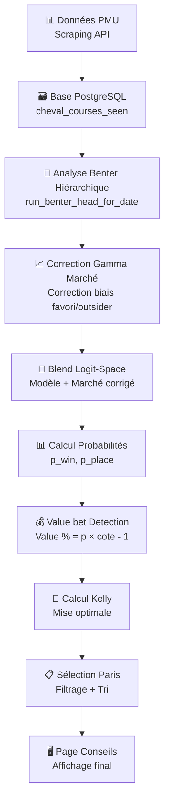

# 🏇 Système d'Analyse des Courses et de Recommandation de Paris

## Vue d'ensemble

Ce document décrit **EXACTEMENT** comment le système analyse les courses hippiques et génère des recommandations de paris sur la page **Conseils** (`/conseils`). Le processus complet suit un pipeline sophistiqué en plusieurs étapes.

---

## 🔄 Pipeline Complet d'Analyse



---

## 1. 📊 Collecte de Données

### Source principale : API PMU
- **Scraper** : [scraper_pmu_simple.py](file:///Users/gicquelsacha/horse3/scraper_pmu_simple.py)
- Récupération de toutes les données pré-départ : cotes, participants, hippodrome, distance, musique, etc.

### Données stockées dans PostgreSQL
Table principale : `cheval_courses_seen`
- `cote_finale` : dernière cote connue
- `cote_reference` : cote de référence pré-off (anti-fuite)
- `tendance_cote` : direction (+/-)
- `amplitude_tendance` : variation en %
- `est_favori`, `avis_entraineur`, `driver_jockey`, etc.

---

## 2. 🧠 Analyse Benter Hiérarchique

### Fonction principale : [run_benter_head_for_date](file:///Users/gicquelsacha/horse3/web/backend/main.py#L6644)

Le système utilise le modèle **William Benter** (mathématicien ayant dominé les courses de Hong Kong) avec des effets contextuels :

```
logit(p_modèle) = η + effets_contextuels + effets_micro
```

### Effets intégrés :
| Effet | Description |
|-------|-------------|
| **Piste** | Performance historique sur cet hippodrome |
| **État du terrain** | Performance selon terrain (bon, lourd, souple...) |
| **Distance** | Performance par catégorie de distance |
| **Corde** | Impact de la position de départ |

### Paramètres clés :
- **τ (tau)** : Température de normalisation (défaut: 1.1)
- **min_support** : Minimum d'observations historiques (60)

### Sortie :
```json
{
  "p_model_norm": 0.1721,      // Probabilité modèle normalisée
  "p_calibrated": 0.1592,      // Probabilité après calibration Platt
  "context_effect": -0.4365,   // Effet contextuel total
  "micro_effect": 0.031        // Effet microstructure
}
```

---

## 3. 📈 Correction Gamma du Marché

### Module : [market_debiaser.py](file:///Users/gicquelsacha/horse3/market_debiaser.py)

Le marché souffre du **biais favori/outsider** :
- Les favoris sont **surcotés** (trop de paris dessus)
- Les outsiders sont **sous-cotés**

### Formule de correction :
```
p_marché_corrigé_i ∝ p_marché_i^γ
```

Puis renormalisation pour que Σp = 1

### Valeur γ :
- **γ < 1** : Augmente les probabilités des outsiders
- **γ > 1** : Augmente les probabilités des favoris
- **Défaut** : `γ = 0.9` (légère correction vers outsiders)

---

## 4. 🔀 Blend Modèle/Marché (Logit-Space)

### Fusion Bayésienne dans l'espace logit :
```
logit(p_final) = α × logit(p_modèle) + (1-α) × logit(p_marché_corrigé)
```

### Alpha dynamique :
Le paramètre α varie selon :

| Facteur | Impact |
|---------|--------|
| **Taille du pool** | Pool plus grand → plus de confiance marché |
| **Temps avant départ** | Plus proche → cotes plus stables |

**Formule** :
```python
α_raw = α_base + α_pool_coef × log(pool_size) - α_time_coef × minutes_to_off
α = clamp(α_raw, α_min, α_max)  # Borné entre 0.3 et 0.9
```

**Valeurs par défaut** :
- `α_base = 0.5`
- `α_min = 0.3` (30% modèle minimum)
- `α_max = 0.9` (90% modèle maximum)

---

## 5. 💰 Calcul de la Value

### Définition Value Bet :
Un **Value Bet** existe quand la probabilité estimée × cote > 1

### Formule Value :
```python
value_pct = (p_win × cote - 1) × 100
```

**Exemple** :
- p_win = 20% (0.20)
- cote = 6.0
- value = (0.20 × 6.0 - 1) × 100 = **+20%**

### Value pour paris placés :
```python
p_place = min(p_win × 2.5, 0.90)  # Approximation Harville simplifiée
cote_place ≈ cote / 3
value_place = (p_place × cote_place - 1) × 100
```

---

## 6. 🎯 Calcul du Critère de Kelly

### Module : [pari_math.py](file:///Users/gicquelsacha/horse3/pari_math.py) & [race_pronostic_generator.py](file:///Users/gicquelsacha/horse3/race_pronostic_generator.py)

### Formule Kelly complète :
```
f* = (b × p - q) / b
```
Où :
- `f*` = fraction du bankroll à miser
- `b` = cote - 1 (gain net pour 1€)
- `p` = probabilité de victoire estimée
- `q` = 1 - p

### Kelly fractionnaire (appliqué) :
```python
kelly_fractional = f* × fraction  # fraction = 0.33 pour "Standard"
stake = bankroll × min(kelly_fractional, cap_per_bet)
```

### Profils Kelly disponibles :
| Profil | Fraction | Description |
|--------|----------|-------------|
| **SÛR** | 0.25 (25%) | Conservateur |
| **STANDARD** | 0.33 (33%) | Équilibré |
| **AMBITIEUX** | 0.50 (50%) | Agressif |

### Caps et plafonds :

| Paramètre | Valeur défaut | Description |
|-----------|---------------|-------------|
| `cap_per_bet` | 2% | Maximum par pari |
| `daily_budget_rate` | 12% | Budget journalier max |
| `rounding_increment` | 0.50€ | Arrondi des mises |
| `max_unit_bets_per_race` | 2 | Max paris par course |

### Exemple de calcul :
```python
# Données
bankroll = 1000€
p_win = 0.25 (25%)
cote = 5.0
profil = "STANDARD" (fraction = 0.33)

# Calcul
b = 5.0 - 1 = 4
f* = (4 × 0.25 - 0.75) / 4 = 0.0625 (6.25%)
kelly_fractional = 0.0625 × 0.33 = 0.0206 (2.06%)

# Avec cap 2%
stake = 1000 × min(0.0206, 0.02) = 20€
```

---

## 7. 📋 Sélection et Filtrage des Paris

### Endpoint API : [/picks/today](file:///Users/gicquelsacha/horse3/web/backend/main.py#L6619)

### Filtres anti-fuite appliqués :
1. `place_finale IS NULL` → Course pas encore courue
2. `statut_participant = 'PARTANT'` → Exclut les non-partants
3. `incident IS NULL` → Exclut DAI, ARR, TOMBE, NP tardif
4. `cote < MAX_PREOFF_COTE (50)` → Exclut outsiders extrêmes
5. `heure_depart > now` → Course pas encore partie

### Critères de sélection :
```python
# 1. Value cutoff (défaut 5%)
if value_pct < value_cutoff * 100:
    exclude(reason="Value insuffisante")

# 2. Kelly > 0
if kelly <= 0:
    exclude(reason="Kelly ≤ 0")

# 3. Microstructure (dérive cote)
if drift_pct >= 0.10:  # Cote monte de +10%
    micro_action = "hold"  # Ne pas miser
elif drift_pct >= 0.05:
    micro_action = "scale_down"  # Réduire mise de 50%

# 4. Limite par course
if count_bets_race > max_unit_bets_per_race:
    exclude(reason="> 2 paris sur cette course")

# 5. Budget journalier
if total_stake + new_stake > daily_budget:
    exclude(reason="Dépasse budget journalier")
```

### Tri des paris :
```python
bets.sort(key=lambda b: (-b['value_pct'], -b['kelly_pct']))
```

---

## 8. 🖥️ Affichage sur la Page Conseils

### Fichier : [Conseils.jsx](file:///Users/gicquelsacha/horse3/web/frontend/src/pages/Conseils.jsx)

### Données affichées par pari :

| Champ | Source | Description |
|-------|--------|-------------|
| **Nom cheval** | BDD | Lien vers fiche cheval |
| **Race key** | BDD | Identifiant course |
| **Type pari** | Calcul | SIMPLE PLACÉ, GAGNANT, E/P |
| **Risque** | Calcul | Faible/Modéré/Élevé |
| **p(win) ou p(place)** | Blend | Probabilité finale |
| **Value %** | Calcul | Edge estimé |
| **Kelly %** | Calcul | Fraction Kelly |
| **Cote** | BDD | Cote pré-off |
| **Mise suggérée** | Kelly | En euros |

### Indicateurs visuels :
- 🟢 **Value >= 20%** : Excellente opportunité
- 🟡 **Value >= 10%** : Bonne opportunité
- 🟠 **Value >= 5%** : Opportunité standard
- ⚪ **Value < 5%** : Sous le cutoff

### Sections affichées :
1. **Paris sélectionnés** : Les meilleurs paris retenus
2. **Paris exclus** (collapsible) : Paris éliminés avec raison

---

## 9. 🔬 Métriques de Calibration

### Vérification continue de la qualité :
- **ECE (Expected Calibration Error)** : Écart proba estimées vs réelles
- **Brier Score** : MSE des probabilités
- **ROC-AUC** : Discrimination du modèle

### Calibration Platt :
```
logit(p_calibré) = a × logit(p_modèle) + b
```
Paramètres appris sur historique.

---

## 📊 Schéma de Données JSON Pick

```json
{
  "cheval_id": 45014,
  "nom": "kara des dunes",
  "race_key": "2025-12-08|R3|C1|CAB",
  "hippodrome": "HIPPODROME DE CABOURG",
  "numero": 16,
  "cote": 2.3,
  "cote_place": 1.05,
  "p_win": 0.4582,
  "p_place": 0.9,
  "value": 5.39,
  "value_pct": 5.39,
  "value_place": -5.5,
  "kelly": 4.14,
  "kelly_pct": 4.14,
  "kelly_place": 0,
  "bet_type": "SIMPLE PLACÉ",
  "bet_type_emoji": "🥉",
  "bet_confidence": "Prudent",
  "bet_risk": "Faible",
  "bet_description": "Paris sécurisé - 90% de place",
  "analysis_source": "benter_head_hierarchique",
  "p_benter_model": 0.4594,
  "context_effect": -0.4365,
  "micro_effect": 0.031,
  "p_market_corr": 0.4357,
  "alpha_dynamic": 0.741,
  "fair_odds": 2.18,
  "micro_action": "bet",
  "micro_score": -0.0149,
  "micro_drift_pct": 1.49,
  "micro_reason": "ok"
}
```

---

## 🎯 Résumé du Processus Décisionnel

### Pourquoi CE pari plutôt qu'un autre ?

1. **Value positive** : `p_modèle × cote > 1.05` (5% minimum)
2. **Modèle confiant** : Analyse Benter + effets contextuels cohérents
3. **Marché aligné** : Blend modèle/marché dans la même direction
4. **Kelly positif** : La formule mathématique recommande une mise
5. **Pas de signal négatif** : Microstructure stable (pas de dérive cote)

### Pourquoi CETTE mise ?

```
Mise = Bankroll × min(Kelly_fractionnaire, 2%) arrondi à 0.50€
```

1. **Kelly fractionnaire** : Fraction du Kelly optimal (33% en Standard)
2. **Cap absolu** : Maximum 2% du bankroll par pari
3. **Budget journalier** : Maximum 12% du bankroll/jour
4. **Arrondi pratique** : Par tranches de 0.50€

### Pourquoi ce TYPE de pari ?

| Situation | Type recommandé |
|-----------|-----------------|
| p_place >= 55% et Value place > -5% | SIMPLE PLACÉ |
| p_win >= 25% et Value win > 0 | GAGNANT |
| Favoris stables, p_place > 70% | E/P (Each-Way) |
| Value win ET place positives | Type le plus avantageux |

---

## 📁 Fichiers Clés du Système

| Fichier | Rôle |
|---------|------|
| [main.py](file:///Users/gicquelsacha/horse3/web/backend/main.py) | API Backend, `/picks/today`, Benter head |
| [race_pronostic_generator.py](file:///Users/gicquelsacha/horse3/race_pronostic_generator.py) | Kelly, Monte Carlo, blend logit |
| [market_debiaser.py](file:///Users/gicquelsacha/horse3/market_debiaser.py) | Correction gamma, alpha dynamique |
| [betting_advisor.py](file:///Users/gicquelsacha/horse3/betting_advisor.py) | Scoring multi-critères |
| [pari_math.py](file:///Users/gicquelsacha/horse3/pari_math.py) | Calculs EV, Kelly, parimutuel |
| [Conseils.jsx](file:///Users/gicquelsacha/horse3/web/frontend/src/pages/Conseils.jsx) | Frontend page Conseils |
| [pro_betting_analyzer.py](file:///Users/gicquelsacha/horse3/pro_betting_analyzer.py) | Analyse pro, normalisation |
